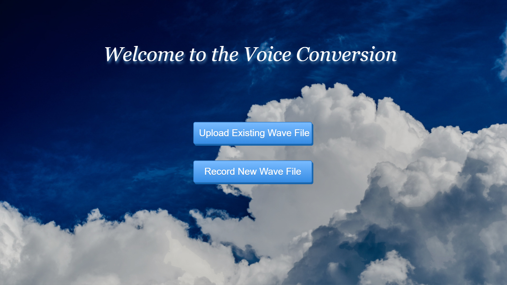
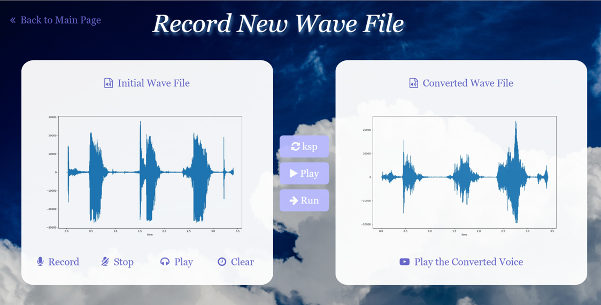
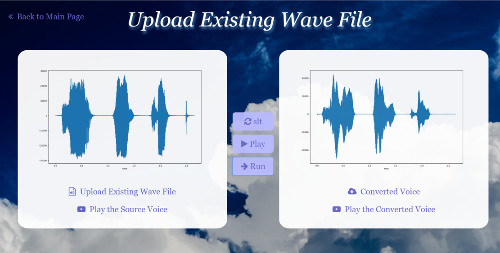

# Voice-Transformer

## Requirement

`tensorflow_plot==0.2.0`
`pydub==0.23.0`
`tensorflow==1.8.0`
`librosa==0.6.2`
`numpy==1.14.2`
`seaborn==0.8.1`
`matplotlib==2.2.2`
`Flask==0.12.2`
`scipy==1.0.0`
`SoundFile==0.10.2`
`tensorpack==0.8.9`
`scikit_learn==0.20.2`

## Tips

1. pip install -r requirements.txt
2. cd Voice Conversion/
3. python voice_conversion.py
4. Open with a browser @http://127.0.0.1:5000/

|  |
| :------------------------------------: |
|                mainpage                |
|  |
|                 record                 |
|  |
|                 upload                 |

3. Follow the instructions on the net page and do voice conversion!

## Collaborators

[jaingmengmeng](https://github.com/jaingmengmeng)

[prime51](https://github.com/prime51)