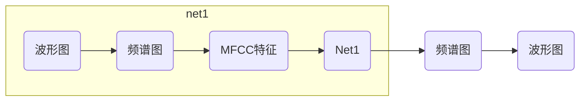

# Voice Conversion 项目报告

### 项目运行步骤

（项目 github 地址：[https://github.com/prime51/Voice-Transformer](https://github.com/prime51/Voice-Transformer)）

1. pip install -r requirements.txt
2. cd Voice Conversion/
3. python voice_conversion.py
4. 用浏览器打开   http://127.0.0.1:5000/ （最好用 Chrome 浏览器打开）

### 模型

#### 模型结构

模型的结构主要由两个网络构成：

+ **Net1：** 分类器，其作用是将语音中的不同频谱分类成不同音素。它的输入是各种语音材料，以及与语音对齐的标签，训练的语音是与说话者相关的，但是训练出来的分类器确实独立的，也就说任何一段语音都能拿来用它分类。**Net1**的训练集是 TIMIT ，一个有630名不同人录的10段语音的数据集。它的流程图如下：

+ **Net2：** 合成器，它包含一个**Net1**，将**Net1**分类得到的音素，加入源声音的特征合成出新的语音。它的输入是源声音的音频，输出是目标声音的音频，其中需要先用**Net1**将源声音音频分类音素，然后学习不同音素的特征，再加入到目标声音的音素中，得到转换后声音的频谱图，最后再将频谱图转换成波形图。它的流程图如下：

#### 模型训练

模型的训练需要注意以下几点：

+ 为了防止过拟合，最后需要加入L2正则化项，提高模型的泛化能力
+ 需要GPU加速，本次项目利用了Google Colab提供的GPU训练平台
+ 利用Tensorboard实时查看模型的训练情况（如loss、accuracy等值的变化情况），以便确定模型什么时候达到最佳效果

### 前后端设计

#### 前端设计

`HTML` +` CSS（3）`+` Javascript`

主要分为三个页面：mainpage（主页）、uploadpage（上传本地音频）、recordpage（录制音频页）。

页面设计主要是为了能实现最终的效果，比较转换前的语音，目标语音和转换后的语音。

#### mainpage

|  |
| :----------------: |
|      mainpage      |

**mainpage** 有两个按钮，**Upload Existing Wave File** 和 **Record New Wave File**，分别对应的功能是跳转到 **uploadpage** 和 **recordpage**。

#### uploadpage

|  |
| :------------------: |
|      uploadpage      |

**uploadpage** 可以分为三个部分，左边是上传本地的wav文件，作为转换前的音频文件，但是因为后端的路径问题没有解决，所以这里只可以上传 **/Voice Conversion/static/audio/** 文件夹下面的wav文件。这里会把上传的音频的频谱图绘制并显示在页面中，用于查看最后的效果。中间是三个按钮，第一个是切换目标声音的按钮，因为项目时间有限，我们只训练了两个目标人的声音—— **slt** 和 **ksp**，所以目标声音只能在两者之间切换。第二个按钮是播放目标声音的一段示例录音。第三个按钮则是开始将源声音转换成目标声音，转换的过程大概需要花费 **30s-50s** 时间，需要测试人耐心等待。转换成功后的语音的频谱图将会在右边显示出来，可以通过点击 **Play the converted voice** 按钮来播放转换后的语音，查看最终的效果。

#### recordpage

|  |
| :------------------: |
|      recordpage      |

**recordpage** 和 **uploadpage** 页面上大致类似，主要是源声音的来源不同，可以临时录制一段长不超过10s的音频，保存在 **/Voice Conversion/static/audio/** 文件夹下面，点击 **Run** 按钮即可开始转换。

#### 后端设计

`Python Flask` + `Ajax` + `jQuery`

&emsp;&emsp;整体框架使用的是 python 的轻量级 web 框架 **Flask**。另外使用 **Ajax** 和 **jQuery** 来实现前后端的交互。

&emsp;&emsp;交互过程主要是为了运行绘制频谱图（draw_wave.py）和转换声音（final_converion.py）这两个 ptyhon 文件。然后将结果显示在页面上。所以，交互的信息主要是需要绘制频谱图的 wav 文件名，待转换声音的源 wav 文件名，以及转换声音的目标人物的名字。服务端收到来自前端的这些信息，就可以在后端命令行运行相应的 python指令，保存结果，并返回给前端。由于前后端交互时的文件路径问题没有解决，所以这里的源 wav 文件都只能放置在 **/Voice Conversion/static/audio/** 文件夹下面。

&emsp;&emsp;由于 **Flask** 框架的不稳定性，在测试过程中有可能出现服务端崩溃的情况，这个时候需要重新启动服务端，清除缓存刷新页面即可。

### 总结

1. 本次项目达到了将目标声音融合源声音音色特点的实验效果，并且不需要完全对齐的训练集，且最终的转换是多对一的，即只需要学习到源声音的特征，可以将任何人的声音转化为源声音
2. 在深度神经网络的模型中，GPU加速尤其重要，而Google Colab给我们提供了一个免费试用的平台
3. 除了课堂学习到的传统提取音频特征的方法，我们借助这个项目学习了如何使用神经网络的模型自动学习音频的特征，而且这些隐藏特征很有可能是传统方法无法发现的
4. 我们的项目还存在一些问题
5. + 输入的目标声音必须保证在一定的时间内，即音频长度是固定的
   + Flask框架的不稳定性导致前端平台可能出现崩溃的情况

### 参考资料

+ [TACOTRON: TOWARDS END-TO-END SPEECH SYNTHESIS](https://arxiv.org/abs/1703.10135)
+ [Deep neural networks for voice conversion (voice style transfer) in ](https://github.com/andabi/deep-voice-conversion)[Tensorflow](https://github.com/andabi/deep-voice-conversion)

